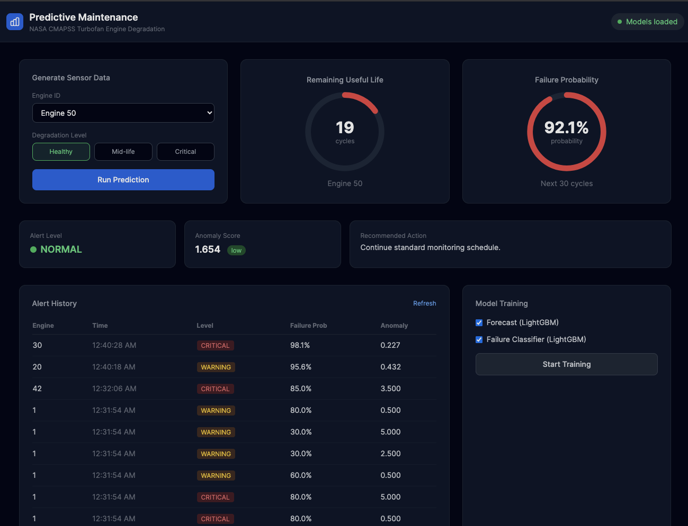
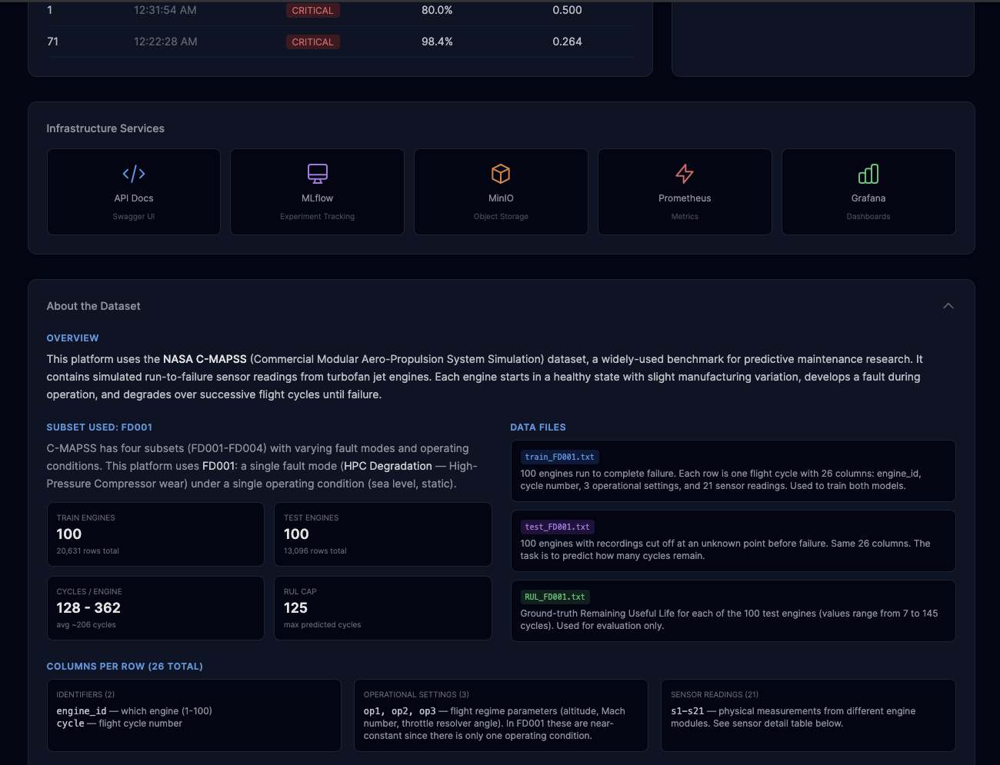
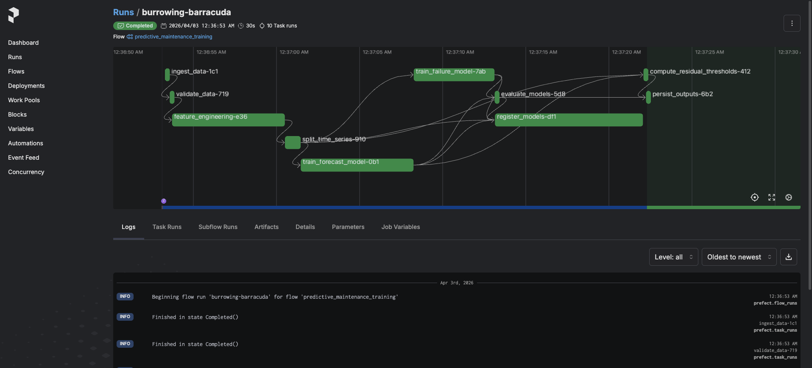
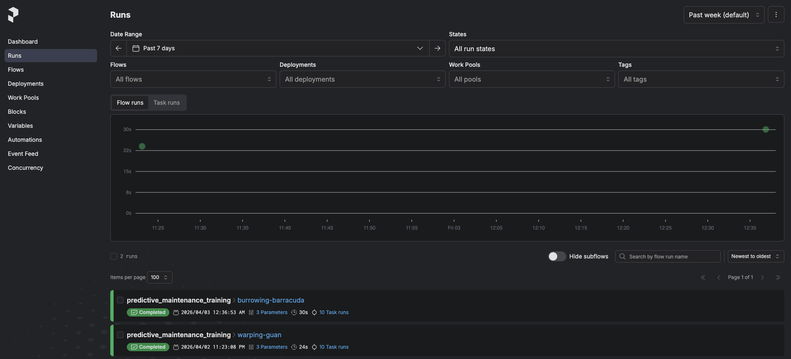
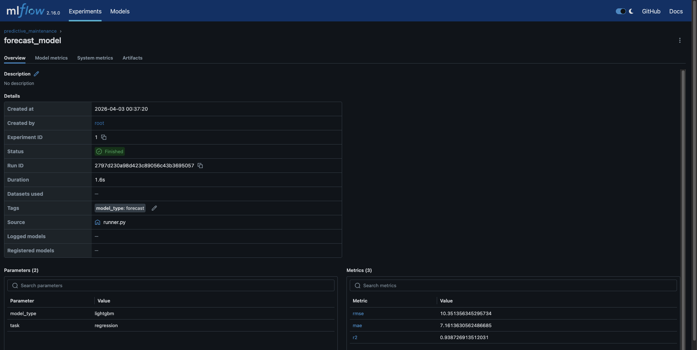
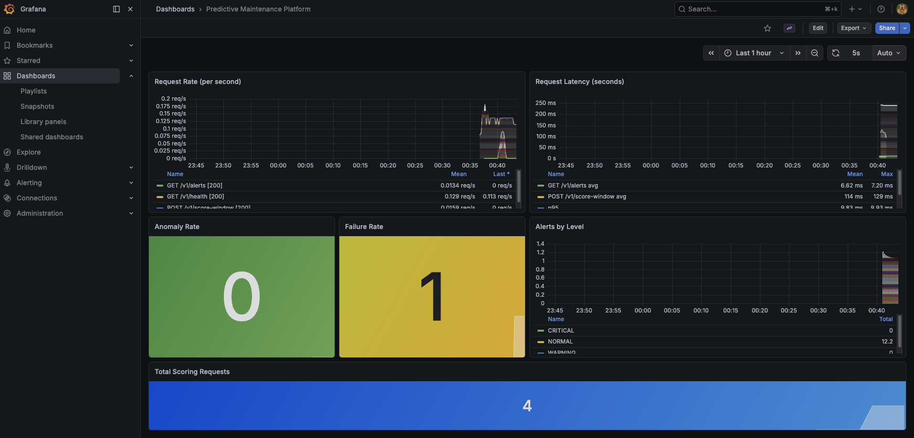
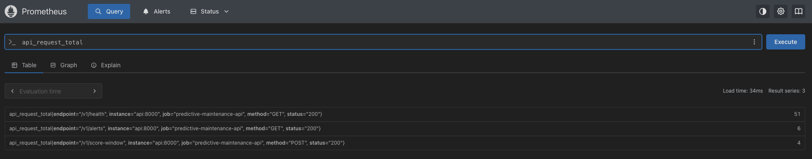
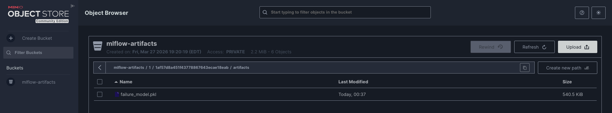
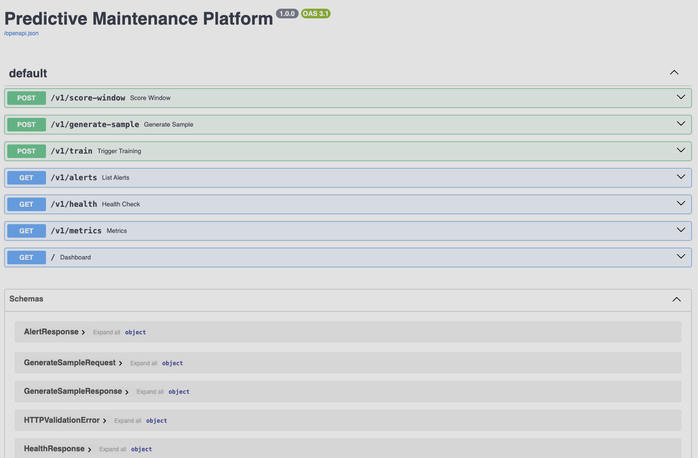

# Predictive Maintenance Platform

**End-to-end ML platform for turbofan engine RUL forecasting, failure classification, and anomaly detection using NASA CMAPSS FD001 dataset**

[](https://www.python.org/downloads/release/python-3110/)
[](https://opensource.org/licenses/MIT)
[](https://hub.docker.com/u/sherozshaikh)

---

## What This Does

Predicts when a turbofan engine will fail based on multivariate sensor readings. Given a window of sensor data, the platform returns:

- **RUL Forecast** -- estimated remaining useful life (cycles)
- **Failure Probability** -- likelihood of failure within the next 30 cycles
- **Anomaly Score** -- how erratic the sensor behavior is (detrended prediction volatility)
- **Alert Level** -- NORMAL, WARNING, or CRITICAL with recommended maintenance action

Trained on the [NASA CMAPSS FD001](https://data.nasa.gov/dataset/cmapss-jet-engine-simulated-data) dataset (100 engines, 21 sensors, run-to-failure).

---

## Architecture

```
                    +------------------+
                    |   Dashboard UI   |
                    |  (localhost:8000) |
                    +--------+---------+
                             |
                    +--------v---------+
                    |    FastAPI        |
                    |  Score / Train   |
                    +--+-----+-----+---+
                       |     |     |
            +----------+  +--+--+  +----------+
            |             |     |             |
    +-------v---+  +------v-+  +v--------+  +v-----------+
    | LightGBM  |  | Alert  |  | Metrics |  |  Storage   |
    | Forecast  |  | Engine |  | Prom.   |  | DuckDB     |
    | + Failure |  +--------+  +---------+  | SQLite     |
    +-----------+                           +------------+

    Training Pipeline (Prefect):
    Ingest -> Validate -> Feature Eng -> Split -> Train -> Evaluate -> Register
```

## Tech Stack

| Layer | Technology |
|-------|-----------|
| API | FastAPI, Uvicorn |
| Models | LightGBM (forecast + failure classifier) |
| Features | Pandas, NumPy (lag, rolling, delta, trend features) |
| Pipeline Orchestration | Prefect (DAG visualization, task state tracking) |
| Experiment Tracking | MLflow + MinIO (S3-compatible artifact storage) |
| Monitoring | Prometheus (metrics collection) + Grafana (dashboards) |
| Storage | DuckDB (features), SQLite (alerts), MinIO (model artifacts) |
| Validation | Pandera (schema validation), Pydantic (API schemas) |
| Deployment | Docker, Docker Compose, GCP free-tier VM |

---

## Quick Start

```bash
git clone https://github.com/sherozshaikh/predictive-maintenance-platform.git
cd predictive-maintenance-platform
```

### Option A: Docker (recommended)

Start Docker (Docker Desktop, or Colima on macOS: `colima start --memory 4 --cpu 2`).

```bash
make up
```

Open http://localhost:8000 -- pre-trained models are included. Click **Run Prediction** to see results.

### Option B: Local (no Docker)

```bash
uv venv .venv --python 3.11 && source .venv/bin/activate
uv pip install -e ".[dev]"
PYTHONPATH=. uvicorn apps.api.main:app --host 0.0.0.0 --port 8000
```

---

## Service Dashboard

When running with `make up`, all services are available:

| URL | Service |
|-----|---------|
| http://localhost:8000 | Platform Dashboard |
| http://localhost:8000/docs | Swagger API Docs |
| http://localhost:4200 | Prefect Pipeline UI |
| http://localhost:5000 | MLflow Experiment Tracking |
| http://localhost:9001 | MinIO Console (minioadmin / minioadmin) |
| http://localhost:9090 | Prometheus |
| http://localhost:3000 | Grafana (admin / admin) |

---

## Models

### LightGBM RUL Forecast (Regression)

Predicts remaining useful life from 155 engineered features (lag, rolling mean/std, delta, linear trend slope, normalized cycle index) across 14 selected sensors.

| Metric | Value |
|--------|-------|
| RMSE | 10.35 |
| MAE | 7.16 |
| R2 | 0.939 |

### LightGBM Failure Classifier (Binary)

Predicts whether the engine will fail within the next 30 cycles.

| Metric | Value |
|--------|-------|
| AUC-ROC | 0.996 |
| F1 | 0.918 |
| Precision | 0.902 |
| Recall | 0.934 |

### Benchmark: LightGBM vs H2O AutoML

H2O AutoML was benchmarked against LightGBM on the same train/validation split. H2O trains GBM, XGBoost, DRF, GLM, Deep Learning, and Stacked Ensembles, then picks the best model.

| Metric | LightGBM | H2O Best (Stacked Ensemble) | Winner |
|--------|----------|----------------------------|--------|
| Forecast RMSE | 10.35 | 10.16 | H2O (+1.8%) |
| Forecast R2 | 0.939 | 0.941 | H2O (+0.2%) |
| Failure AUC | 0.996 | 0.997 | H2O (+0.08%) |
| Training Time | **3.3s** | **245s** | LightGBM (74x faster) |

**Decision**: LightGBM is the production model. H2O's stacked ensemble is marginally better but 74x slower, requires a JVM, and adds ~500MB to the image. The accuracy difference is negligible for this use case.

Run the benchmark locally: `make benchmark` (requires `uv pip install -e ".[dev,benchmark]"`)

---

## API Endpoints

| Method | Endpoint | Description |
|--------|----------|-------------|
| POST | `/v1/score-window` | Score a sensor window (30 cycles) and return RUL, failure probability, anomaly score, alert |
| POST | `/v1/generate-sample` | Generate synthetic sensor data (healthy / mid / critical) |
| POST | `/v1/train` | Trigger model retraining in background |
| GET | `/v1/alerts` | List recent alerts |
| GET | `/v1/health` | Health check (model load status) |
| GET | `/v1/metrics` | Prometheus metrics |

### Example: Score a Sensor Window

```bash
# Generate synthetic critical-stage data and score it
curl -s -X POST http://localhost:8000/v1/score-window \
  -H "Content-Type: application/json" \
  -d "$(curl -s -X POST http://localhost:8000/v1/generate-sample \
    -H 'Content-Type: application/json' \
    -d '{"engine_id":1,"degradation":"critical"}')" | python3 -m json.tool
```

Response:

```json
{
    "engine_id": 1,
    "forecast": 6.4,
    "anomaly_score": 0.19,
    "anomaly_level": "low",
    "failure_probability_next_30_cycles": 0.983,
    "alert_level": "CRITICAL",
    "recommended_action": "Immediate inspection required. Schedule emergency maintenance within 24 hours."
}
```

---

## Training Pipeline

The training pipeline is orchestrated by Prefect with `@flow` and `@task` decorators:

```
Ingest Data -> Validate Schema -> Feature Engineering -> Time-Series Split
    -> Train Forecast Model -> Train Failure Model
        -> Evaluate -> Compute Anomaly Thresholds -> Register to MLflow -> Persist Outputs
```

### Train via Docker (with Prefect UI)

```bash
make up      # start infra (includes Prefect server)
make train   # run training worker
```

View the DAG and task states at http://localhost:4200.

### Train Locally

```bash
make train-local
```

---

## Deploy to GCP Free-Tier VM

The API Docker image includes pre-trained models. Deploy to a GCP `e2-micro` (free tier) in under 5 minutes:

```bash
# On the VM (Ubuntu 22.04):
sudo apt-get update && sudo apt-get install -y docker.io
sudo fallocate -l 1G /swapfile && sudo chmod 600 /swapfile && sudo mkswap /swapfile && sudo swapon /swapfile
sudo docker pull sherozshaikh/predictive-maintenance-api:1.1.0
sudo docker run -d --name pm-api --restart unless-stopped -p 8000:8000 -e PYTHONPATH=/app sherozshaikh/predictive-maintenance-api:1.1.0
```

Open `http://<VM_EXTERNAL_IP>:8000` (ensure port 8000 is open in the firewall).

For the full step-by-step guide (VM creation, firewall rules, static IP, start/stop): [docs/DEPLOY_GCP.md](docs/DEPLOY_GCP.md)

---

## Run Tests

```bash
make test-local   # 72 tests, local
make test         # 72 tests, inside Docker container
```

---

## Project Structure

```
predictive-maintenance-platform/
├── apps/
│   ├── api/
│   │   ├── main.py              # FastAPI application entry point
│   │   ├── routes.py            # API endpoints
│   │   ├── schemas.py           # Pydantic request/response models
│   │   ├── scoring.py           # Inference service (thread-safe)
│   │   ├── synthetic.py         # Synthetic data generator (CMAPSS-calibrated)
│   │   └── static/index.html    # Dashboard UI
│   └── worker/
│       └── runner.py            # Docker training worker
├── pipelines/
│   ├── direct_runner.py         # Direct training execution
│   ├── mlflow_logger.py         # MLflow model registration
│   └── flows/
│       └── training_flow.py     # Prefect @flow definition
│   └── tasks/
│       ├── data_tasks.py        # Ingest, validate, feature eng, split
│       ├── training_tasks.py    # Model training @tasks
│       └── evaluation_tasks.py  # Evaluation, registration, thresholds
├── models/
│   ├── forecast/lgbm_forecast.py   # RUL regression model
│   └── failure/lgbm_failure.py     # Failure classification model
├── features/
│   ├── ingestion.py             # CMAPSS data loading
│   ├── validation.py            # Pandera schema validation
│   └── engineering.py           # 155 features (lag, rolling, delta, trend)
├── alerts/
│   ├── anomaly.py               # Anomaly scoring (detrended volatility)
│   └── engine.py                # Alert level computation
├── monitoring/
│   └── metrics.py               # Prometheus metrics (thread-safe)
├── storage/
│   ├── duckdb_store.py          # Feature storage
│   └── sqlite_store.py          # Alert storage
├── configs/
│   ├── settings.py              # Pydantic settings
│   ├── model.yaml               # Model hyperparameters
│   ├── pipeline.yaml            # Pipeline configuration
│   └── infra.yaml               # Infrastructure settings
├── scripts/
│   ├── run_flow.py              # CLI for training pipeline
│   ├── benchmark_h2o.py         # LightGBM vs H2O AutoML benchmark
│   └── test_distribution.py     # Alert distribution validation
├── tests/                       # 72 tests (API, alerts, storage, models, features, scoring)
├── docker/
│   ├── Dockerfile.api           # API image (with pre-trained models)
│   ├── Dockerfile.worker        # Training worker image
│   └── prometheus.yml           # Prometheus scrape config
├── docker-compose.yml           # Full platform stack
├── pyproject.toml               # Dependencies and project metadata
├── Makefile                     # Development and deployment commands
└── RUNBOOK.md                   # Operational guide
```

---

## Screenshots

### Dashboard -- Predictions (Healthy, Mid-Life, Critical)


### Dashboard -- Infrastructure Services and Dataset Info


### Prefect -- Training Pipeline DAG


### Prefect -- Flow Run History


### MLflow -- Experiment Tracking


### Grafana -- Monitoring Dashboard


### Prometheus -- API Metrics


### MinIO -- Model Artifact Storage


### FastAPI -- Interactive API Docs


---

## License

MIT License - see [LICENSE](LICENSE) file for details.

---

## Author

**Sheroz Shaikh** - [GitHub](https://github.com/sherozshaikh) | [LinkedIn](https://www.linkedin.com/in/sherozshaikh/)
